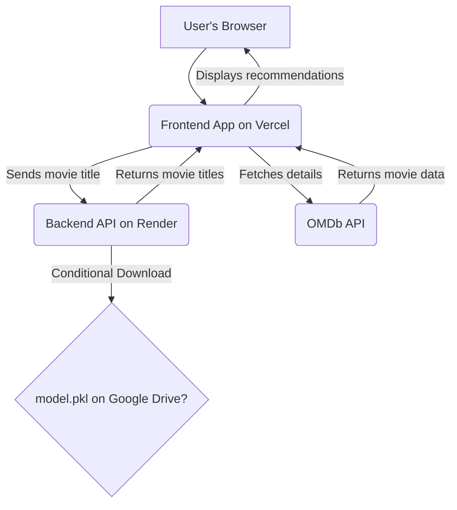

# 🎬 Movie Recommendation System

A fullstack web application that provides movie recommendations based on content-based filtering.

---

## 📊 Architecture Workflow



---

## ✨ Overview

This project leverages Python for its recommendation engine (served via Flask) and presents personalized recommendations through a modern React frontend interface.

---

## 🚀 Key Technologies

### 🐍 Backend
- **Python**
- **Flask**
- **pandas**
- **scikit-learn**
- **Render** (Deployment)

### ⚛️ Frontend
- **React**
- **Vite**
- **Tailwind CSS**
- **Vercel** (Hosting)
- **OMDb API** (Movie metadata)

---

## 📁 Project Structure

```
movie-recommender/
├── backend/                      # Flask API for recommendations
├── movie-app/                    # React UI built with Vite
└── Movie_recommendation_system.ipynb  # Model development in Colab
```

---

## ▶️ How to Run

### 🧠 Backend (Flask API)
```bash
cd backend
python -m venv venv
source venv/bin/activate  # Windows: venv\Scripts\activate
pip install -r requirements.txt
python app.py
```

### 🎨 Frontend (React + Vite)
```bash
cd movie-app
npm install
npm run dev
```

### 📓 Jupyter Notebook
Open `Movie_recommendation_system.ipynb` in **Google Colab** to view or retrain the ML model.

> ℹ️ Each section contains its own `README.md` for detailed setup instructions.

---

## 🔗 Links

- **Live App**: [Frontend on Vercel](https://movie-recommender-nu-three.vercel.app)
- **Backend API**: [Render Deployment](https://movie-recommender-bit5.onrender.com)
- **ML Model**: [model.pkl on Google Drive](https://drive.google.com/file/d/1sGPdOb3SJLy7TzSn5ULYVKQplsR0tLpk/view)

> Note: The Flask backend automatically downloads the `.pkl` model from Google Drive using `gdown` when deployed.

---

## 🚧 Struggles & Solutions

| Problem | Solution |
|--------|----------|
| `model.pkl` exceeds GitHub's 100MB limit | Hosted on Google Drive, downloaded using `gdown` |
| `tuple` unpacking error from `.pkl` | Used `similarity, data = pickle.load(f)` instead of dict access |
| CORS blocking API calls | Enabled with `flask_cors.CORS(app)` before route definitions |
| 404/405 errors on `/recommend` | Ensured route accepts POST and URL is correct |
| Case-sensitive movie input | Normalized input using `.lower()` and added fuzzy matching with `difflib` |
| Postman works, browser doesn’t | CORS handled in Flask but needed correct placement |
| React `.map()` error | Adjusted backend to return `{ "recommendations": [...] }` |
| Silent frontend failures | Used DevTools and Vercel logs to debug issues |

---

## 🌐 Deployment

- **Backend**: [Render](https://render.com/)
- **Frontend**: [Vercel](https://vercel.com/)

---
